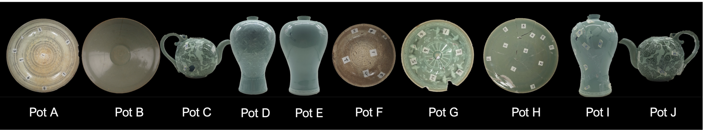

# Structure-from-Sherds (Pre-processing)

This repository contains the **pre-processing** code for the Structure-from-Sherds project, which focuses on preparing pottery fragment data for reconstruction. The pre-processing pipeline includes:

1. **Mesh-to-Surface**  
2. **Breakline Extraction**
3. **Axis Extraction**

# Dataset

Total 10 different potteries with 142 fragments. Scanned from real-broken sherds (not in the real-scale)



Dataset structure:
```
Dataset/
├── Mesh/
│   ├── Pot_A/
│   ├── Pot_B/
│   ├── ...
│   └── Pot_J/
└── Point/
    ├── Pot_A/
    ├── Pot_B/
    ├── ...
    └── Pot_J/
```

Each folder contains the data for the corresponding pottery fragment.

## Overview
Pottery fragments (3D scans in `.obj` format) are turned into processed point clouds with relevant surface information and geometric features that aid in the reconstruction process.

## Dependencies
- PCL (Point Cloud Library): 1.9.1
  - Required for point cloud processing and surface analysis
- CGAL: 5.0
  - Used for mesh processing and surface operations
- C++ 17 or higher

- MatLab (for Axis Extraction)

## Building the Project

### Using Docker

1. Build the Docker image:
   ```bash
   docker build -t sfs_pre:latest .
   ```
2. Download Dataset
   ```
   sh ./download.sh
   ```
3. Run docker container
   ```
   sh ./setup_container.sh
   ```
   - You might have to change --volume="/Dataset:/Dataset" \ at line 20 according to your dataset path
4. Build with cmake file
   ```
    ## Command at container ##
    mkdir build
    cd build
    cmake .. -DCMAKE_BUILD_TYPE=Release 

    make
   ```
5. Run the program

## Running the Pre-processing Pipeline

### Step-by-Step Execution Order

1. **Mesh-to-Surface Processing**
   ```bash
   # Inside the build directory
   ./Meshprocessing
   ```
   This will generate:
   - `*_SampledWithNormals.ply`: Point cloud with normals
   - `*_Surface_X.ply/xyz`: Segmented surfaces

2. **Surface-to-Breakline Processing**
   ```bash
   # After generating surface files
   ./EdgeLineExtraction
   ```
   This will generate:
   - `*_CompleteBreaklines.xyz`: Final breakline output

3. **Axis Extraction**
   ```bash
   # Using MATLAB
   # 1. Open preprocess_new_pots.m in MATLAB
   # 2. Edit the root_path variable to point to your data directory
   # 3. Run the script
   ```

## Pre-processing Pipeline (Mesh2Surface)

Mesh2Surface processing converts raw 3D mesh files into processed point clouds for surface analysis and segmentation.

1. **Mesh to Point Cloud Conversion**  
   - Samples original `.obj` files using CloudCompare (up to 1,000,000 points)  
   - Applies initial noise filtering  
   - Output: PCD format point cloud

2. **Surface Processing**  
   - **Normal Estimation & Orientation**: PCA-based normal estimation with k-nearest neighbors  
   - **Uniform Sampling**: Reduces point density while preserving surface features  
   - **Surface Segmentation**: Region growing based on normal similarity, curvature, and proximity  

3. **Surface Analysis & Refinement**  
   - **B-Spline Surface Fitting**: Improves boundary definition and reduces noise  
   - **Cluster Analysis**: Merges related segments and handles special cases  

## Pre-processing Pipeline (Surface2Breakline)

After finishing **Mesh2Surface** steps (generating `*_Surface_X.xyz`), we run the **breakline** code to extract and refine boundaries on each fragment. This process produces a final boundary file, `*_CompleteBreaklines.xyz` or `.pcd`, which can be used for matching or assembly in downstream tasks.

1. **Breakline Detection**  
   - **Initial boundary detection** based on surface normals (e.g., `BoundaryEstimation` in PCL)  
   - Automatic ordering of boundary points into continuous segments

2. **Smoothing & Resampling**  
   - Each breakline is **resampled using B-spline** fitting to remove noise  
   - Sharp curvature regions can be split further using **peak detection**

3. **Optional Projection & Classification**  
   - Fit a global B-spline surface to the entire fragment; project breakline points for refined normals  
   - Classify breaklines (e.g., **rim** vs. **non-rim**) if pot axis data is available  

4. **Output**  
   - **Final breaklines** (`*_CompleteBreaklines.xyz` or `.pcd`) – **primary** output 

## Pre-processing Pipeline (AxisExtraction)
The axis extraction process is based on the PotSAC algorithm described in [Hong et al., 2019](https://openaccess.thecvf.com/content_ICCVW_2019/papers/EH/Hong_PotSAC_A_Robust_Axis_Estimator_for_Axially_Symmetric_Pot_Fragments_ICCVW_2019_paper.pdf). This method provides a robust way to estimate the rotational axis of axially symmetric pottery fragments.

1. **Surface Normal Analysis**
   - Computes the cross product of surface normals to generate axis candidates
   - Uses MLESAC-based filtering to identify consistent axis directions

2. **Axis Refinement**
   - Applies weighted optimization to refine the initial axis estimate
   - Minimizes the distance between the axis and normal-derived lines

3. **Execution in MATLAB**
   - The implementation is provided in MATLAB scripts
   - Main script: `preprocess_new_pots.m` handles the complete axis extraction workflow


## Configuration Parameters

### Surface Segmentation Parameters
- `minCluster`: Minimum cluster size (default: 50)
- `noOfNeighbours`: Number of neighbors for region growing (default: 10)
- `smoothnessAngleThreshold`: Angle threshold for smoothness (default: 4.0)
- `curvatureThreshold`: Threshold for curvature calculation (default: 1.0)

### Processing Parameters
- `samplingRadius`: Radius for uniform sampling
- `normalEstimationNeighbors`: Number of neighbors for normal estimation
- `mergingThreshold`: Threshold for cluster merging

### Breakline Extraction Parameters
- `breaklineSearchRadius`: Neighborhood radius around breakline points (default: 3.0)
- `bSplineOrder`: Polynomial order for B-spline smoothing on breaklines (commonly 3)


### Output Files
- **Point Cloud Files**  
  - `*_Point.pcd`: Initial point cloud conversion  
  - `*_SampledWithNormals.ply`: Point cloud with computed normals  
  - `*_Surface_0.ply/xyz`, `*_Surface_1.ply/xyz`: Segmented surfaces  

- **Breakline Files**  
  - `*_CompleteBreaklines.xyz` or `.pcd`: **Refined final boundary curves** (primary output of Surface2Breakline)


## License
SfS++ is licensed under the CC-BY-NC-SA-4.0 license limiting any commercial use.

## Citation
If you use this code in your research, please cite:
```
@inproceedings{YooandLiu2024SfS,
    title={Structure-from-Sherds++: Robust Incremental 3D Reassembly of Axially Symmetric Pots from Unordered and Mixed Fragment Collections},
    author={Yoo, Seong Jong and Liu, Sisung and Arshad, Muhammad Zeeshan and Kim, Jinhyeok and Kim, Young Min and Aloimonos, Yiannis and Fermuller, Cornelia and Joo, Kyungdon and Kim, Jinwook and Hong, Je Hyeong},
    journal={arXiv preprint arXiv:2502.13986},
    year={2025}
}
```
```
@inproceedings{HongandYoo_2021_ICCV,
	title     = {Structure-From-Sherds: Incremental 3D Reassembly of Axially Symmetric Pots From Unordered and Mixed Fragment Collections},
  author    = {Hong, Je Hyeong and Yoo, Seong Jong and Zeeshan, Muhammad Arshad and Kim, Young Min and Kim, Jinwook},
	journal   = {Proceedings of the IEEE/CVF International Conference on Computer Vision (ICCV)},
	month     = {October},
	year      = {2021},
	pages     = {5443-5451}
}
```
```
@inproceedings{hong2019potsac,
  title={PotSAC: A Robust Axis Estimator for Axially Symmetric Pot Fragments.},
  author={Hong, Je Hyeong and Kim, Young Min and Wi, Koang-Chul and Kim, Jinwook},
  booktitle={ICCV Workshops},
  pages={1421--1428},
  year={2019}
}
```